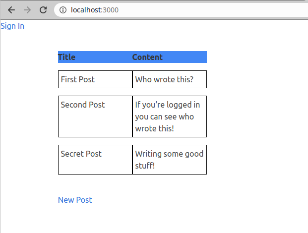
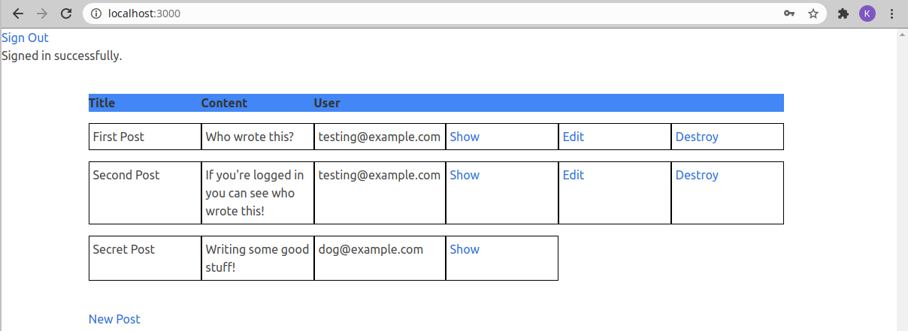

# Members Only
In this project, I built an exclusive forum where members can write posts about non-members while remaining anonymous; inside the forum, members can see who the author of a post is but, outside, they can only see the story and wonder who wrote it.
 
 

## What I Learned
This project furthered my knowledge of working with Authenticating users in Ruby on Rails.
The authentication was done using the Devise Gem.
As an extra, I did minimal styling with the Bulma Gem to familiarize myself with installing different gems and testing them.

### Showcase

